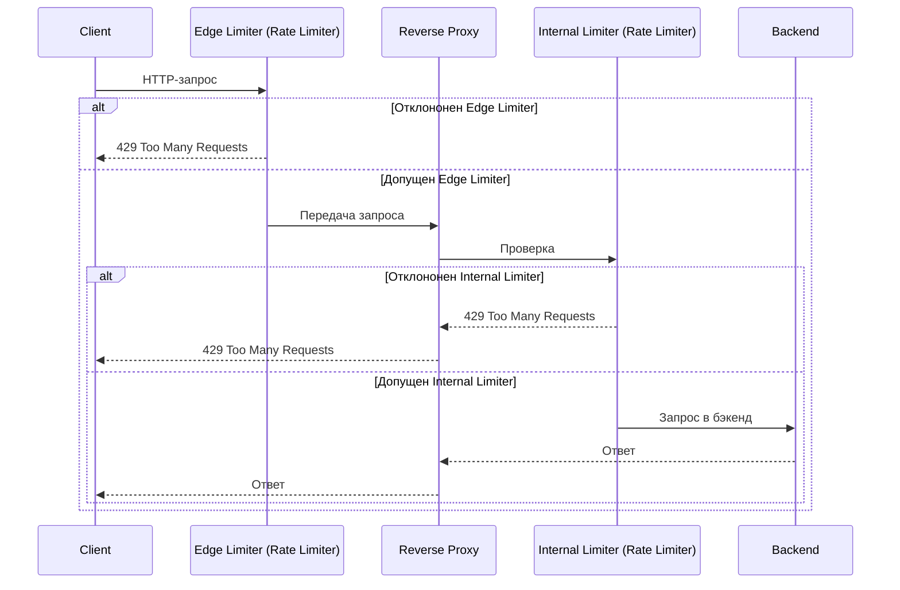

# Gateway 

HTTP-gateway на Go с проксированием запросов и ограничением их количества.
Сбор метрик — Prometheus (экспонируется на /metrics).
**Стек:** *Go, Redis*
Пример работы - docker-compose.test.yaml

Состоит из двух основных компонентов:

- Rate Limiter:
  - Edge limiter (внешний лимитер) - защищает сервис от перегрузки на входе
  - Internal limiter (внутренний лимитер) - ограничивает обращения к конкретным бэкендам
- Reverse Proxy - маршрутизация по host + path до бекенда

### Основные возможности

- Ограничение запросов на входе (*edge limiter*) нескольних типов: глобально, по IP
- Ограничение запросов к каждому бэкенду *(internal limiter*)
- Алгоритмы: *fixed window*, *sliding window*, *token bucket*
- Маршрутизация по пути и хосту
- Prometheus-метрики для прокси и лимитеров
- panic recovery middleware
- graceful shutdown

  

### Схема


### Метрики
Доступ к метрикам - по белому списку. Используются три счётчика:
- *upstreamProxy* - количество запросов, направленных до сервису.
- *internal_limiter* и *edge_limiter* - считают решения внутреннего лимитера, отклонил/не отклонил

### Структура конфигурации (config.yaml + env)

```env
HOST=0.0.0.0
PORT=80
LOG_LEVEL=INFO
EDGE_LIMITER_REDIS_URL=redis://redis:6379/0
PROXY_LIMITER_REDIS_URL=redis://redis:6379/1
```

```yaml
proxy:
  router:
    upstreams:
      legacy: http://localhost:8080
      orders: http://localhost:9000
      users: http://localhost:9001

    default: legacy

    routes:
      - host: new.api.ex
        default: legacy
        pathes:
          - path: /api/orders
            upstream: orders

          - path: /api/users
            upstream: users
        
      - host: old.api.ex
        pathes:
          - path: /
            upstream: legacy
    
  limiter:                      # опционально — лимит на каждый backend
    type: token_bucket
    algorithm:
      capacity: 100
      rate: 100.5
      
edge_limiter: 
  is_global: true               # false = по IP, true = глобальный
  limiter:
    type: fixed_window
    algorithm:
      limit: 4
      window_duration: 1s
    storage: 
      ttl: 1s

metrics:
  hosts:
    - localhost
```

Примеры конфигураций
1. Простой прокси без лимитов
```yaml
proxy:
  router:
    upstreams:
      base: http://localhost:8080
    default: base
```

2. Разные бэкенды по хостам
```yaml
proxy:
  router:
    default: http://main-app:8080
    hosts:
      - host: api.host
        default: http://api-v2:3000
      - host: admin.host
        default: http://admin:9001
proxy:
  router:
    upstreams:
      api: http://localhost:9000
      admin: http://localhost:9001

    routes:
      - host: api.host
        default: legacy

      - host: admin.host
      - default: admin      
```

3. Жёсткий лимит 100 запросов/мин с каждого IP
```yaml
edge_limiter:
  is_global: false
  limiter:
    type: fixed_window
    algorithm:
      limit: 100
      window_duration: 1m
```
4. Token Bucket 500 токенов, пополнение 10/сек
```yaml
edge_limiter:
  limiter:
    type: token_bucket
    algorithm:
      capacity: 500
      rate: 10.0
```
