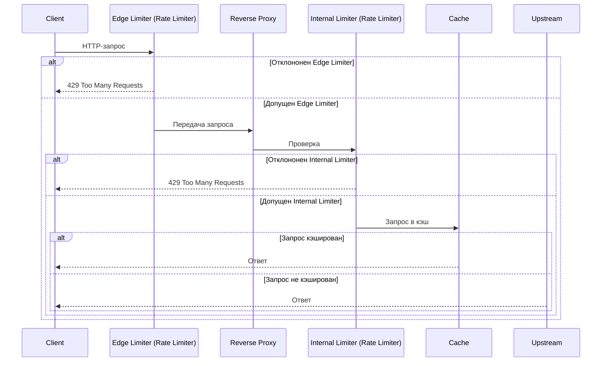

# Gateway 

HTTP-gateway на Go с проксированием запросов и ограничением их количества.
Сбор метрик — Prometheus (экспонируется на /metrics).
**Стек:** *Go, Redis*
Пример работы:
```bash
docker compose -f docker-compose.test.yaml up test-client
```

Состоит из трех компонентов:

- Ограничитель скорости:
  - Edge (внешний лимитер) - защищает сервис от перегрузки на входе
  - Internal (внутренний лимитер) - ограничивает обращения к конкретным бэкендам
- Обратный прокси - маршрутизация по host + path до upsteam
- Кэш - кэширование запросов в upstream

### Основные возможности

- Ограничение запросов на входе нескольних типов: глобально, по IP
- Ограничение запросов к каждому бэкенду
- Алгоритмы: *fixed window*, *sliding window*, *token bucket*
- Маршрутизация по пути и хосту
- Кэширование запросов
- Prometheus-метрики для прокси, лимитеров и кэша
- panic recovery middleware
- graceful shutdown

  
### Схема

```mermaid
sequenceDiagram
    participant C as Client
    participant E as Edge Limiter (Rate Limiter)
    participant R as Reverse Proxy 
    participant I as Internal Limiter (Rate Limiter)
    participant Ch as Cache
    participant U as Upstream

    C->>E: HTTP-запрос
    alt Отклононен Edge Limiter
        E-->>C: 429 Too Many Requests
    else Допущен Edge Limiter
        E->>R: Передача запроса
        R->>I: Проверка
        alt Отклононен Internal Limiter
            I-->>C: 429 Too Many Requests
        else Допущен Internal Limiter
            I->>Ch: Запрос в кэш
            alt Запрос кэширован
              Ch-->>C: Ответ
            else Запрос не кэширован
              U-->>C: Ответ
            end
        end
    end
```

### Метрики
Доступ к метрикам - по белому списку. Используются три счётчика:
- *upstream_proxy* - количество запросов, направленных до сервису.
- *cache* - считают кэш-промахи и кэш-попадания для каждого запроса.
- *internal_limiter* и *edge_limiter* - считают решения внутреннего лимитера, отклонил/не отклонил

### Структура конфигурации (config.yaml + env)

```env
HOST=0.0.0.0
PORT=80
LOG_LEVEL=INFO
REDIS_URL=redis://redis:6379
```

```yaml
proxy:
  router:
    upstreams:
      legacy: http://localhost:8080
      orders: http://localhost:9000
      users: http://localhost:9001

    default: legacy

    routes:
      - host: new.api.ex
        default: legacy
        pathes:
          - path: /api/orders
            upstream: orders
            cache:
              /unconfirmed/:order_id: 10s

          - path: /api/users
            upstream: users
            cache:
              /online: 1s

      - host: old.api.ex
        pathes:
          - path: /
            upstream: legacy
    
  limiter:                      # опционально — лимит на каждый сервис
    type: token_bucket
    algorithm:
      capacity: 100
      rate: 100.5
      
edge_limiter:
  is_global: true               # false = по IP, true = глобальный
  type: fixed_window
  algorithm:
    limit: 4
    window_duration: 1s
  storage: 
    ttl: 1s

metrics:
  hosts:
    - localhost
```

Примеры конфигураций
1. Простой прокси без лимитов
```yaml
proxy:
  router:
    upstreams:
      base: http://localhost:8080
    default: base
```

2. Разные бэкенды по хостам
```yaml
proxy:
  router:
    upstreams:
      api: http://localhost:9000
      admin: http://localhost:9001

    routes:
      - host: api.host
        default: legacy

      - host: admin.host
      - default: admin      
```

3. Жёсткий лимит 100 запросов/мин с каждого IP
```yaml
edge_limiter:
  is_global: false
  type: fixed_window
  algorithm:
    limit: 100
    window_duration: 1m
```

4. Token Bucket 500 токенов, пополнение 10/сек
```yaml
edge_limiter:
  type: token_bucket
  algorithm:
    capacity: 500
    rate: 10.0
```
